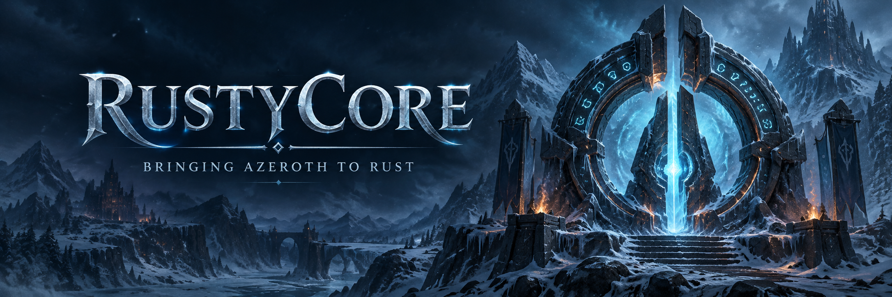

<p align="center">
  
</p>

<p align="center">
  <strong>Bringing Azeroth to Rust.</strong><br>
  A WotLK Classic 3.4.3 server emulator built for faithful behavior and a welcoming community.
</p>

<p align="center">
  <a href="LICENSE"></a>
  <a href="https://www.rust-lang.org/"></a>
  <a href="docs/README.md"></a>
  
  <a href="https://discord.gg/mH6ACpGPb2"></a>
</p>

<p align="center">
  <a href="#quick-start">Get started</a> ·
  <a href="https://alseif0x.github.io/rustycore/">Documentation</a> ·
  <a href="#roadmap">Roadmap</a> ·
  <a href="#contributing">Contribute</a> ·
  <a href="#community">Community</a>
</p>

## About

RustyCore is an active, full-port effort: a TrinityCore-style WotLK Classic server being
rebuilt in Rust. The target is full behavioral parity with the 3.4.3 C++ reference, with
packet formats, database behavior, gameplay rules, and runtime order checked against the
source before they are treated as correct.

Parts of login and world entry work, and many systems are represented in the workspace.
The live gameplay runtime is still under migration, so RustyCore is not a drop-in replacement
or a claim of complete gameplay parity yet. The [current state](docs/migration/STATE.md) is
dated and records the evidence behind each status claim.

## Documentation

The [documentation map](docs/README.md) routes each question to its maintained source.

- [Current state](docs/migration/STATE.md) — implementation, evidence, and known boundaries.
- [Server setup](docs/wiki/server/setup.md) — requirements, configuration, and startup.
- [Client setup](docs/wiki/client/setup.md) — endpoints and the login/world-entry smoke path.
- [Database bootstrap](docs/operations/db-bootstrap.md) — schemas, TDB content, and migrations.
- [Validation V2](docs/operations/validation-v2.md) — focused, final, and exhaustive checks.
- [Live client debugging](docs/operations/live-client-debug.md) — authorized runtime evidence.

## Roadmap

The [port plan](docs/migration/PORT_PLAN.md) describes the full-parity work and its order.
Use the [current state](docs/migration/STATE.md) for what has evidence today; historical
roadmaps, percentages, and archived handoffs do not replace it.

## Target and prerequisites

| Area | Current target |
| --- | --- |
| Client | WotLK Classic `3.4.3.54261` |
| Rust | `1.98.0`, pinned in [`rust-toolchain.toml`](rust-toolchain.toml) |
| Protobuf compiler | `28.3`, pinned in [`.protoc-version`](.protoc-version) |
| Databases | MariaDB `10.6+` or MySQL `8.x`; `auth`, `characters`, `world`, `hotfixes` |
| World data | Trinity/TDB-style content; expected `TDB 343.24081`, `cache_id = 24081` |
| Manual testing | Extracted client data (`dbc`, `db2`, `maps`, `vmaps`, `mmaps` as needed) |

You will also need a local configuration and, for Battle.net authentication, TLS certificate
material. Keep credentials, certificates, database URLs, and runtime configuration outside Git.
The [server setup guide](docs/wiki/server/setup.md) and [DB bootstrap guide](docs/operations/db-bootstrap.md)
cover the operator prerequisites.

## Quick start

Clone the integration branch and let `rustup` use the repository's pinned toolchain:

```bash
git clone https://github.com/alseif0x/rustycore.git
cd rustycore
git switch 3.4.3
```

Install a `protoc` release matching `.protoc-version` (`28.3`), then point `PROTOC` at it.
Build the two server binaries with one Cargo job:

```bash
PROTOC=/path/to/protoc cargo build --locked --release -j1 \
  -p bnet-server -p world-server
```

Prepare the four databases and required world data with the [DB bootstrap guide](docs/operations/db-bootstrap.md).
Create private `bnetserver.conf` and `worldserver.conf` files, then set their database,
TLS, realm, and `DataDir` values. The root-level config names and `.conf.d` directories are
ignored by Git.

Start Battle.net first and the world server second, in separate terminals:

```bash
./target/release/bnet-server --config /absolute/path/to/bnetserver.conf
./target/release/world-server --config /absolute/path/to/worldserver.conf
```

The usual local ports are:

| Service | Port |
| --- | ---: |
| Battle.net RPC over TLS | `1119` |
| Battle.net REST | `8081` |
| World socket | `8085` |
| Instance socket | `8086` |

Check the [client setup guide](docs/wiki/client/setup.md) before connecting a client. The
integrated [smoke bot](tools/wow-test-bot/README.md) covers a narrow login and world-entry
scenario; passing it does not establish full gameplay parity.

## Workspace

RustyCore is a Cargo workspace. These groups show where to start; the complete member list
lives in the root [`Cargo.toml`](Cargo.toml).

| Area | Crates |
| --- | --- |
| Services | `bnet-server`, `world-server`, `rustycore-db` |
| Protocol and transport | `wow-packet`, `wow-proto`, `wow-handler`, `wow-network`, `wow-session` |
| World and gameplay | `wow-world`, `wow-map`, `wow-entities`, `wow-data`, `wow-movement`, `wow-combat` |
| Persistence and data | `wow-database`, `wow-persistence`, `wow-config`, `wow-core` |
| Extensions | `wow-module-api`, `world-modules`, `wow-script`, `wow-scripts`, `wow-ai` |
| Supporting libraries | `wow-constants`, `wow-crypto`, `wow-chat`, `wow-loot`, `wow-instances`, `wow-social` |
| Tools | `capture-diff` and the tools under `tools/` |

## Contributing

RustyCore welcomes code, tests, packet evidence, documentation, issue reports, and thoughtful
discussion. Start with [CONTRIBUTING.md](CONTRIBUTING.md), then check the [documentation map](docs/README.md)
and [current state](docs/migration/STATE.md) before choosing a task. Gameplay and protocol
work needs the relevant C++ source anchor or target-build capture so that the port preserves
known behavior instead of guessing.

## Community

Questions, design conversations, and introductions are welcome on
[Discord](https://discord.gg/mH6ACpGPb2). For a reproducible defect or a bounded improvement,
open a [GitHub issue](https://github.com/alseif0x/rustycore/issues). Please keep sensitive
runtime details and credentials out of public issues.

The documentation site is published at [alseif0x.github.io/rustycore](https://alseif0x.github.io/rustycore/).

## Support the project

RustyCore takes time: protocol research, C++ archaeology, Rust porting, database work, packet
tests, client testing, and long debugging sessions. Donations are welcome if you want to
support the time needed to keep the project moving.

| Network | Wallet |
| --- | --- |
| BTC | `bc1qeggjcl5guwmqr0aa4emufyzyh7nu5rkfrytqy8` |
| ETH / BNB | `0xfec63e014e0bd36d77b094ff27f7e7f5d7ab67aa` |
| Solana | `9ktt1zinmwwsZXGx9x1BM995FwbAfdNWe65v1mdPgDhn` |
| XRP | `rBVvKPrQAmd5uDZ89nDgz5HbSWVD6sTbg2` |

## License

RustyCore is licensed under **GPL-3.0-or-later** (GNU GPL version 3 or any later version).
See [LICENSE](LICENSE) for the complete license text and [NOTICE](NOTICE) for the
project's license grant and attribution notices.

WoW protocol research and server behavior are based on the public work of the TrinityCore
and MaNGOS communities.

World of Warcraft is owned by Blizzard Entertainment. This project is not affiliated with,
endorsed by, or sponsored by Blizzard Entertainment.
