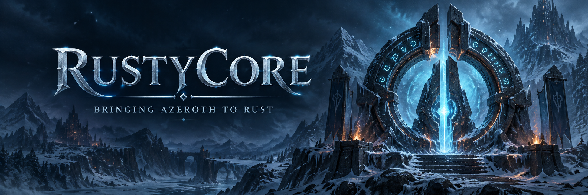

<p align="center">
  
</p>

<p align="center">
  <strong>RustyCore · Forever</strong><br>
  Bringing a new generation of Classic to Rust.<br>
  Experimental server support for <strong>WoW Forever 1.60.1 · build 70170 · Beta x64</strong>.
</p>

<p align="center">
  <a href="LICENSE"></a>
  <a href="https://www.rust-lang.org/"></a>
  <a href="docs/operations/forever-login.md"></a>
  
  
  <a href="https://discord.gg/mH6ACpGPb2"></a>
</p>

<p align="center">
  <a href="#what-works-today">Progress</a> ·
  <a href="#quick-start">Build & test</a> ·
  <a href="docs/operations/forever-login.md">Forever runbook</a> ·
  <a href="#roadmap">Next milestones</a> ·
  <a href="#contributing">Contribute</a> ·
  <a href="#community">Community</a>
</p>

## A new Classic client. A Rust foundation.

This is the **`forever` development branch** of RustyCore, starting from the
[WotLK Classic `3.4.3` codebase](https://github.com/alseif0x/rustycore/tree/3.4.3)
at `2df57d6f`. Its target is the **modern WoW Forever client**, not the original
Vanilla 1.12.1 protocol.

`3.4.3` and `forever` are independent version lines. Forever fixes and pull
requests target `forever`; this port is not intended to be merged wholesale
into `3.4.3`. A GitHub **Compare & pull request** suggestion after a push does
not change that workflow. Client version numbers remain separate from branch names.
Compatibility with 3.4.3 is **not** a requirement of this branch. Shared code is
reused where it fits the Forever client; incompatible protocols and behavior are
replaced using target-build evidence, not retained for historical compatibility.

The first real-client milestone is in: build **70170** completes normal HTTPS
SRP authentication, Battle.net Authentication V2, account queries and a realm-list
ticket exchange against RustyCore. It now also displays Forever's **ruleset
selection screen**, with the PvP option from the configured SuperDistrict.
In the isolated online probe, it accepts the configured realm and modern join
ticket, opens the world connection, answers the **65-byte AuthChallenge** and
passes strict verification of its **24-byte AuthSession digest**. The derived
40-byte session key is persisted in the disposable Auth fixture.
No password bypass or synthetic login success.

> **Research preview — not playable yet.** The real client now logs into the
> target-specific encrypted Session, shows the empty **character selection**
> screen and opens **creation UI with a 3D human warrior preview**.
> After implementing typed `TactKey` query delivery, a fresh probe again reaches
> race/class selection and **personalization**, with rendered 3D models.
> Earlier repeats stalled during loading; broader repeatability is not yet proven.
> Saving a character and entering the world remain unimplemented; a visible
> creation screen is not persistence. The normal fixture stays offline.
> The diagnostic launcher setup is not a turnkey client installer.

## What works today

Evidence recorded on **2026-10-02–03**, with the real Windows x64 client running in
an isolated Wine environment on a Linux x86_64 host:

| Stage | Status | Evidence / boundary |
| --- | --- | --- |
| BNet TLS connection and connection identity | Verified | Real build-70170 client |
| HTTPS SRPv2 and Authentication V2 | Verified | Successful proof, token verification and `OnLogonComplete` |
| Account V2 queries | Verified | Account and game-account information/restrictions |
| Realm-list ticket and subregion discovery | Verified | Real client accepts the responses |
| Offline realm-list serialization | Smoke-tested | V1/V2 test client decodes `1.60.1.70170`; not a realm-selector UI pass |
| Forever `SuperDistrictList` and ruleset UI | Verified | Real client displays and selects PvP for configured district 1 |
| Realm discovery after ruleset choice | Verified in isolated probe | Client accepts content 136 / district 1 and requests realm `0x02010001` |
| Modern BNet realm join | Verified | JSON ticket, build variant and session-key persistence; real client accepts the response |
| World TCP, V2 preamble and AuthSession proof | Verified in isolated probe | Native 70170 digest verified; 40-byte session key persisted; build key kept private |
| Signed encryption / AES-256-GCM traffic | Verified in isolated probe | Native ACK, encrypted requests and server replies; no signature bypass |
| Target character-data acquisition | Verified locally | Actual classes/races, six model/customization tables and 434 readable Achievement rows; nine Achievement rows remain unavailable |
| Target Session / initial server packet sequence | Verified in isolated probe | Real Character/Auth query holders, ordered success initialization and native enum request |
| TactKey DBQueryBulk / DBReply | Implemented; native batch observed | Real baseline + official/custom SQL overlays; missing requested records get Invalid, never fabricated keys |
| Empty character selection | Verified with real client | Database-backed empty list and «Crear personaje» button |
| Creation UI / personalization | Observed with real client | Fresh probe reaches human warrior customization and rendered models; no character saved |
| Target appearance validation | Implemented; native QA passed | Seven real DB2 baselines + SQL overlays/removals; nine native human-warrior choices validate, without a save/success response |
| Name-availability request | Codec verified with native 70170 | Private 22-byte request matches target layout; name policy, collision query and response delivery are still pending |
| Target name-rule data | Implementation under validation | Four complete native WDC5 baselines, checked strings, SQL overlays and final removals; regex matching and availability delivery remain pending |
| Character creation / nonempty enumeration | Pending | Name/admission, starting Player state and durable persistence still required; no character saved |
| Initial world load | Pending | Requires target-build packets and appropriate world/client data |

The current evidence includes **133 BNet tests**, **364 database tests** (2
additional integration tests ignored), **40 Python tests**, **59 crypto tests**,
**37 transport tests**, and
live V1/V2 positive/negative authentication scenarios. These counts describe the
recorded scoped checks, not a full-workspace or gameplay-parity certification.
The [runbook](docs/operations/forever-login.md) records exact revisions, source
anchors, failures, timings and the observed client trace.
The account-phase delivery additionally passed **764 data / 362 database / 767
packet / 35 persistence / 4048 world tests**, with 2 database and 1 world tests
ignored, plus 1 target-binary ticket test, 48 Python guards and 9 probe CLI guards.
The authenticated-idle correction passed **42 transport tests** and a fresh
three-minute native connection. Typed TactKey delivery additionally passed **774
data tests**, the affected database/packet/persistence/world suites (**4052 world
tests**, 1 ignored), and the target-binary test and normal build. A fresh native
probe reaches customization after receiving two DBReply batches. No key material
is distributed with this repository.
These are scoped results; the ordinary 600-second acceptance budget was exceeded.
The character-data candidate additionally passed **760 data tests**, **4 strict
fixture tests**, **6 acquisition guards** and **9 negative private-copy cases**;
the real tables decode through Rust. These are data/admission prerequisites,
not playable-race selection or character creation.

The full `validation-v2 final` gate is currently blocked by inherited architecture
hotspot limits and legacy ownership-baseline mismatches. The shared registry
relocation adds no legacy Session growth; no limits or baselines were relaxed.
The passing scoped checks above are not
a substitute for that gate; see the runbook's publication boundary.

## Documentation

Start with the branch-specific material; inherited guides still describe 3.4.3
unless explicitly marked otherwise.

- [Forever login runbook](docs/operations/forever-login.md) — isolated fixture, protocol evidence and current blocker.
- [Current state](docs/migration/STATE.md) — implementation, evidence, and known boundaries.
- [Documentation map](docs/README.md) — maintained project references.
- [Inherited server setup](docs/wiki/server/setup.md) and [database bootstrap](docs/operations/db-bootstrap.md) — 3.4.3 foundation, not verified Forever world setup.
- [Validation V2](docs/operations/validation-v2.md) — focused, final, and exhaustive checks.
- [Live client debugging](docs/operations/live-client-debug.md) — authorized runtime evidence.

## Roadmap

1. **Save a real character.** Login, empty selection and creation UI are now
   observed. Implement target validation, creation transactions and nonempty
   enumeration, then verify persistence with the real client.
2. **Complete character admission.** Load the saved target character without
   legacy protocol or invented player state.
3. **Load the initial world.** Confirm the required data, initial packet sequence
   and client loading result.

These are dependency-ordered goals, not release dates or completed compatibility
claims. The parent [3.4.3 port plan](docs/migration/PORT_PLAN.md) remains separate;
inherited gameplay implementation does not establish support for build 70170.

The installed client's two character tables have been acquired privately in
`esES`. Forever uses **WDC5/version 5**, not the inherited WDC4 header. Their
schema hashes match the pinned Forever reference; old field mappings are not
treated as interchangeable. See the [character-data prerequisite](docs/operations/forever-login.md#build-70170-character-data-prerequisite)
for acquisition, validation and the remaining world/character database boundary.

## Target and prerequisites

| Area | Current target |
| --- | --- |
| Client | WoW Forever `1.60.1.70170` — Beta x64 |
| Branch / foundation | `forever`, based on `3.4.3` at `2df57d6f` |
| Rust | `1.98.0`, pinned in [`rust-toolchain.toml`](rust-toolchain.toml) |
| Protobuf compiler | `28.3`, pinned in [`.protoc-version`](.protoc-version) |
| Accepted local fixture | Disposable MariaDB `11.4`, separate Auth / Character / World / Hotfix schemas |
| World data | Pinned target TDB plus source-ordered updates; gameplay parity not established; no 3.4.3 drop-in data |
| Manual testing | Your own client installation and the documented diagnostic launcher setup |

You will also need a local configuration and, for Battle.net authentication, TLS certificate
material. Keep credentials, certificates, database URLs, and runtime configuration outside Git.
Use the [Forever runbook](docs/operations/forever-login.md) for the accepted local
scope. It deliberately keeps the test realm offline and does not start a world server.

## Quick start

Clone this experimental branch and let `rustup` use the pinned toolchain:

```bash
git clone --branch forever https://github.com/alseif0x/rustycore.git
cd rustycore
```

Install a `protoc` release matching `.protoc-version` (`28.3`), then point `PROTOC` at it.
Build the Battle.net server with one Cargo job:

```bash
PROTOC=/path/to/protoc cargo build --locked --release -j1 \
  -p bnet-server
```

Provision **a fresh disposable Auth database** and private TLS/configuration
material using the [runbook](docs/operations/forever-login.md). Provisioning is
operator-controlled, not a one-command install; never point the fixture at a
shared or existing realm database. After preparation, start the local BNet server:

```bash
RUST_LOG=warn ./target/release/bnet-server \
  --config /absolute/path/to/private-runtime/bnetserver.conf
```

In another terminal, exercise the normal authentication path:

```bash
python3 tools/wow-test-bot/forever_bnet_smoke.py \
  --runtime /absolute/path/to/private-runtime
```

The checker reads the fixture's private password file, verifies the TLS
certificate and SRP server proof, and reports sanitized results. It does not
create a character or join a world. There is **no published default password**.

The recorded isolated fixture uses loopback-only endpoints:

| Service | Port |
| --- | ---: |
| Battle.net RPC over TLS | `1119` |
| Battle.net HTTPS REST | `18081` |
| Disposable MariaDB | `13316` |
| World metadata only — no listener started | `18085` |

Advertised HTTPS URLs use `localhost` to match the test certificate. Do not copy
these development endpoints, credentials or certificates into a public deployment.

## Workspace

RustyCore is a Cargo workspace. These groups show where to start; the complete member list
lives in the root [`Cargo.toml`](Cargo.toml).

| Area | Crates |
| --- | --- |
| Services | `bnet-server`, `world-server`, `rustycore-db` |
| Protocol and transport | `wow-packet`, `wow-proto`, `wow-handler`, `wow-network`, `wow-session` |
| World and gameplay | `wow-world`, `wow-map`, `wow-entities`, `wow-data`, `wow-movement`, `wow-combat` |
| Persistence and data | `wow-database`, `wow-persistence`, `wow-config`, `wow-core` |
| Extensions | `wow-module-api`, `world-modules`, `wow-script`, `wow-scripts`, `wow-ai` |
| Supporting libraries | `wow-constants`, `wow-crypto`, `wow-chat`, `wow-loot`, `wow-instances`, `wow-social` |
| Tools | `capture-diff` and the tools under `tools/` |

## Contributing

RustyCore welcomes code, tests, packet evidence, documentation, issue reports, and thoughtful
discussion. Start with [CONTRIBUTING.md](CONTRIBUTING.md), then check the [documentation map](docs/README.md)
and [current state](docs/migration/STATE.md) before choosing a task. Gameplay and protocol
work needs the relevant C++ source anchor or target-build capture so that the port preserves
known behavior instead of guessing.

## Community

Questions, design conversations, and introductions are welcome on
[Discord](https://discord.gg/mH6ACpGPb2). For a reproducible defect or a bounded improvement,
open a [GitHub issue](https://github.com/alseif0x/rustycore/issues). Please keep sensitive
runtime details and credentials out of public issues.

The documentation site is published at [alseif0x.github.io/rustycore](https://alseif0x.github.io/rustycore/).

## Support the project

RustyCore takes time: protocol research, C++ archaeology, Rust porting, database work, packet
tests, client testing, and long debugging sessions. Donations are welcome if you want to
support the time needed to keep the project moving.

| Network | Wallet |
| --- | --- |
| BTC | `bc1qeggjcl5guwmqr0aa4emufyzyh7nu5rkfrytqy8` |
| ETH / BNB | `0xfec63e014e0bd36d77b094ff27f7e7f5d7ab67aa` |
| Solana | `9ktt1zinmwwsZXGx9x1BM995FwbAfdNWe65v1mdPgDhn` |
| XRP | `rBVvKPrQAmd5uDZ89nDgz5HbSWVD6sTbg2` |

## License

RustyCore is licensed under **GPL-3.0-or-later** (GNU GPL version 3 or any later version).
See [LICENSE](LICENSE) for the complete license text and [NOTICE](NOTICE) for the
project's license grant and attribution notices.

WoW protocol research and server behavior are based on the public work of the TrinityCore
and MaNGOS communities.

World of Warcraft is owned by Blizzard Entertainment. This project is not affiliated with,
endorsed by, or sponsored by Blizzard Entertainment.
